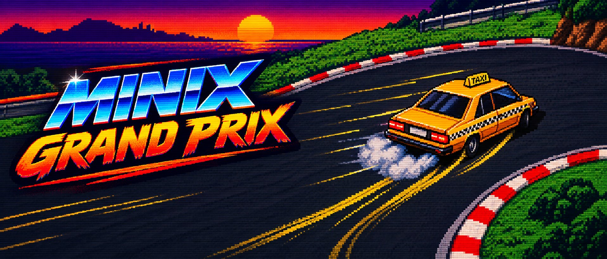

# MINIX Grand Prix

<p align="center">
  
</p>


## Project Description

MINIX Grand Prix is a top-down racing game for MINIX, built from scratch on top of our own device drivers:
- Timer;
- Keyboard;
- Mouse;
- Video graphics;
- RTC (real-time clock).

Pick a vehicle (taxi, police car or ambulance) and a track (grass, arctic or lava), and race three laps against the clock. The game has a scrolling camera, a minimap, a speedometer, nitro and drifting, a pause menu, and a leaderboard that records each player's best times with the date read from the RTC.

This was a 4-person team project (myself, José Maio, Vasco Guimarães and Victor Gomez) for the Laboratório de Computadores (LCOM) course unit, FEUP, 2025/26.

The original delivered README is kept intact in [`Delivered_Readme.md`](./Delivered_Readme.md), and my individual lab assignments (lab1 to lab5) are in [`labs/`](./labs).

> This repository is a personal copy (with full commit history preserved) of the original group submission on FEUP's GitLab.

## My Contribution

[Revê e ajusta — tirado dos teus commits:]
- Scrolling track map and camera;
- Complete overhaul of the track, camera and collision system, including checkpoints in the collision maps;
- Car sprites: from 8 to 16 angles, and then 48 sprites for smooth rotation;
- Improved track 3 map and the controls screen shown at the start of a race.

## Environment

1. In the root of the repository, build the driver libraries:
```sh
./create_libs.sh
```

2. Build and run the game inside MINIX:
```sh
cd project
make
lcom_run proj
```
